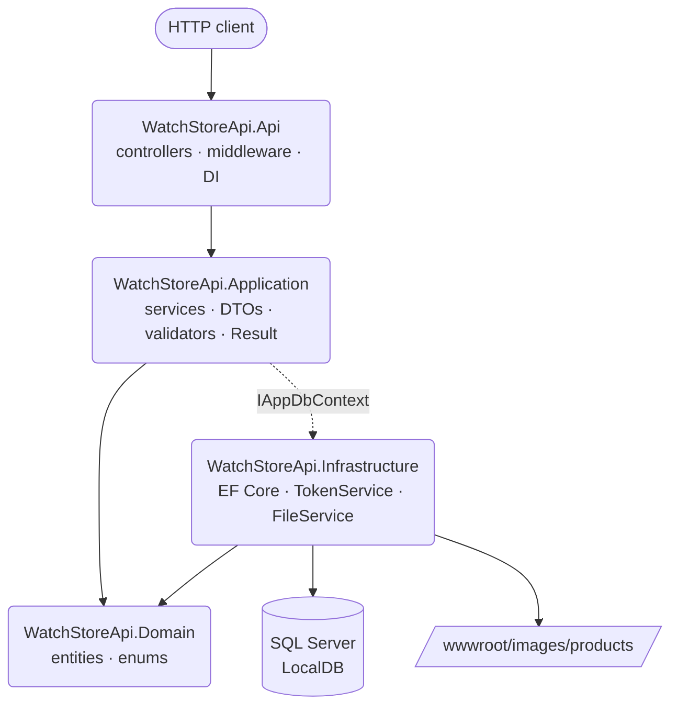

# WatchStoreApi

> A clean-architecture watch e-commerce REST API built with ASP.NET Core 10. JWT authentication, layered solution, EF Core with SQL Server, FluentValidation, Scalar UI, and a full xUnit test suite.

[](https://github.com/mrkotbest/WatchStoreApi/actions/workflows/ci.yml)
[](https://dotnet.microsoft.com/)
[](LICENSE.txt)
[](https://learn.microsoft.com/ef/core/)
[](https://github.com/mrkotbest/WatchStoreApi/releases)

---

## Why WatchStoreApi

A reference implementation of a small but realistic e-commerce backend — catalog, cart, checkout, refresh-token auth, admin analytics — written the way a production .NET service would be: layered into Domain / Application / Infrastructure / Api projects, with EF Core hidden behind an `IAppDbContext` interface, business outcomes returned as `Result<T>` instead of thrown exceptions, and image uploads validated by magic bytes rather than file extension.

## Features

- **Layered architecture** — separate `Domain`, `Application`, `Infrastructure`, and `Api` projects. Application code never references EF or ASP.NET directly.
- **JWT authentication** with hashed refresh tokens, role-based authorization (`User` / `Admin`), and token revocation (rotation + reuse detection).
- **Result pattern** — services return `Result` / `Result<T>` with embedded HTTP status codes; controllers stay thin and never throw for business errors.
- **EF Core 10 + SQL Server (LocalDB)** — code-first migrations, fluent configurations, seed data for 4 categories and 20 watches.
- **FluentValidation 12** — auto-validation via a global MVC action filter, returning RFC 7807 `ValidationProblemDetails` on 400.
- **Rate limiting** — fixed window for auth endpoints, sliding window for the rest.
- **File uploads** validated by extension, size, and **magic bytes**, stored under GUID names in `wwwroot/images/products/`.
- **OpenAPI** generated by Swashbuckle, rendered with **[Scalar UI](https://scalar.com/)** at `/scalar/v1` in Development.
- **Global exception handling** via RFC 7807 `ProblemDetails`.
- **98 tests** — unit (Moq + EF Core InMemory) and integration (`WebApplicationFactory<Program>`).

## Quick start

**Prerequisites:**

- [.NET SDK 10.0](https://dotnet.microsoft.com/download)
- SQL Server LocalDB (ships with Visual Studio or as a [standalone installer](https://learn.microsoft.com/sql/database-engine/configure-windows/sql-server-express-localdb))
- `dotnet-ef` global tool: `dotnet tool install --global dotnet-ef --version 10.0.5`

```bash
git clone https://github.com/mrkotbest/WatchStoreApi.git
cd WatchStoreApi

# 1. Start LocalDB (Windows)
sqllocaldb start MSSQLLocalDB

# 2. Provide a JWT signing key (must be 32+ chars). Stored in user-secrets, never in the repo.
dotnet user-secrets --project src/WatchStoreApi.Api set "Jwt:Key" "<your-32-plus-char-secret>"

# 3. Apply migrations — creates the WatchStoreDb database with seed data
dotnet ef database update `
  --project src/WatchStoreApi.Infrastructure `
  --startup-project src/WatchStoreApi.Api

# 4. Run
dotnet run --project src/WatchStoreApi.Api
```

Open **https://localhost:7095/scalar/v1** for the interactive API reference. Raw OpenAPI document is at `/swagger/v1/swagger.json`.

## REST API

| Method | Path | Auth | Description |
| ------ | ---- | ---- | ----------- |
| `POST` | `/api/auth/register` | — | Register a new user, returns the new id. |
| `POST` | `/api/auth/login` | — | Returns access + refresh tokens. |
| `POST` | `/api/auth/refresh` | — | Rotates the refresh token, returns a new pair. |
| `POST` | `/api/auth/revoke` | user | Revokes a refresh token (logout). |
| `GET`  | `/api/categories` | — | Lists all categories. |
| `GET`  | `/api/products?search=&categoryId=&material=&gender=&minPrice=&maxPrice=&pageNumber=&pageSize=` | — | Paginated product catalog with filters. |
| `GET`  | `/api/products/{id}` | — | Single product. |
| `GET`  | `/api/cart` | user | Current user's cart. |
| `POST` | `/api/cart` | user | Add a product to cart. |
| `PUT`  | `/api/cart/{productId}` | user | `increase` / `decrease` quantity. |
| `DELETE` | `/api/cart/{productId}` | user | Remove an item. |
| `POST` | `/api/orders` | user | Create an order from the current cart (transactional). |
| `GET`  | `/api/orders` | user | Paginated list of user's orders. |
| `GET`  | `/api/orders/{orderId}` | user | Order details (own orders only). |
| `POST` `PUT` `DELETE` | `/api/admin/categories` `…/{id}` | admin | Category CRUD. |
| `POST` `PUT` `DELETE` | `/api/admin/products` `…/{id}` | admin | Product CRUD with image upload (multipart/form-data). |
| `GET`  | `/api/admin/dashboard` | admin | Total / pending orders, revenue, products, categories. |
| `GET`  | `/api/admin/revenue?range=monthly\|weekly\|yearly` | admin | Last 7 periods of delivered revenue. |
| `GET`  | `/api/admin/orders?…` | admin | Paginated orders with status / date / user filters. |
| `GET`  | `/api/admin/orders/pending` | admin | Pending orders only. |
| `GET`  | `/api/admin/orders/{orderId}` | admin | Order line items with product info. |
| `PUT`  | `/api/admin/orders/{orderId}/status` | admin | Transition order status (validated by a state machine). |

`Authorization: Bearer <accessToken>` header is required for `user` / `admin` routes. Order status follows a strict state machine — see `OrderStatusMachine.cs`.

## Architecture



Dependencies flow inward: `Domain` knows nothing, `Application` depends only on `Domain`, `Infrastructure` adds the EF / file / token implementations, and `Api` wires them together. The `IAppDbContext` abstraction in `Application` keeps services free of any direct EF Core dependency on `DbContext` lifetime.

## Tech stack

- **ASP.NET Core 10.0** — Web API host
- **Entity Framework Core 10** with `Microsoft.EntityFrameworkCore.SqlServer`
- **JWT Bearer** authentication (`Microsoft.AspNetCore.Authentication.JwtBearer`)
- **FluentValidation 12** — auto-registered from the Application assembly, run by a global MVC action filter
- **Swashbuckle.AspNetCore 9** — OpenAPI document generation
- **Scalar.AspNetCore** — interactive API reference UI
- **xUnit 2.9 + Moq 4.20 + Microsoft.AspNetCore.Mvc.Testing + EFCore.InMemory** — tests

## Project layout

```
WatchStoreApi/
├── src/
│   ├── WatchStoreApi.Domain/          # Entities, enums — no dependencies
│   ├── WatchStoreApi.Application/     # Services, DTOs, validators, Result, IAppDbContext
│   ├── WatchStoreApi.Infrastructure/  # AppDbContext, EF configurations, migrations,
│   │                                  # TokenService, FileService, CurrentUserService
│   └── WatchStoreApi.Api/             # Controllers, middleware, Program.cs, appsettings
└── tests/
    └── WatchStoreApi.Tests/           # Unit + integration tests
```

## Configuration

Configuration is layered (`appsettings.json` → `appsettings.Development.json` → environment variables → user-secrets). Every secret comes from outside the repo.

| Key | Where | Notes |
| --- | ----- | ----- |
| `ConnectionStrings:DefaultConnection` | `appsettings.Development.json` (LocalDB) / env var in prod | Empty in `appsettings.json` by design. |
| `Jwt:Key` | user-secrets / env (`Jwt__Key`) | **Required**, 32+ chars. App refuses to start otherwise. |
| `Jwt:Issuer`, `Jwt:Audience`, `AccessTokenExpirationMinutes`, `RefreshTokenExpirationDays` | `appsettings.json` | Sensible defaults provided. |
| `FileStorage:MaxFileSizeBytes`, `AllowedExtensions`, `UploadPath` | `appsettings.json` | 5 MB / `.jpg .jpeg .png .webp` / `images/products`. |
| `RateLimiting:LoginPermitLimit`, `LoginWindowSeconds`, `GeneralPermitLimit`, `GeneralWindowSeconds` | `appsettings.json` | Two policies: `auth` (fixed window) and `general` (sliding window). |
| `Cors:AllowedOrigins` | `appsettings.Development.json` for local | Empty array → `AllowAnyOrigin`. |

## Database & seed data

The initial migration (`20260503161956_InitialCreate`) creates all tables and seeds:

- **4 categories** — Classic, Smart, Premium, Luxury
- **20 products** — distinct watches spread across the four categories (Doroly, Aristos, Modicci, Aurum, Aeri, Hope, Torque Chain, Force Pro, Maxfit, Valentina, Ace, Favous, Highlight, Vanesio, Diesel, Spectrum, Wondrous, Chrono, Ironman, Royal)

Seed data is declared in `Infrastructure/Persistence/SeedData.cs` (called from `OnModelCreating` via `HasData`). To change the seed, **add a new migration** — never edit an existing one.

The database file itself is **not** committed; every contributor recreates it locally with `dotnet ef database update`.

## Tests

```bash
dotnet test
```

- **Unit tests** (`tests/WatchStoreApi.Tests/Unit/Services/`) cover every service against EF Core InMemory.
- **Integration tests** (`tests/WatchStoreApi.Tests/Integration/`) boot the whole pipeline through `WebApplicationFactory<Program>` and hit the real HTTP endpoints. The factory swaps SQL Server for InMemory and inflates rate limits, so 98 tests run end-to-end in roughly 5 seconds.

## License

MIT — see [LICENSE.txt](LICENSE.txt).

Author: [@mrkotbest](https://github.com/mrkotbest)
